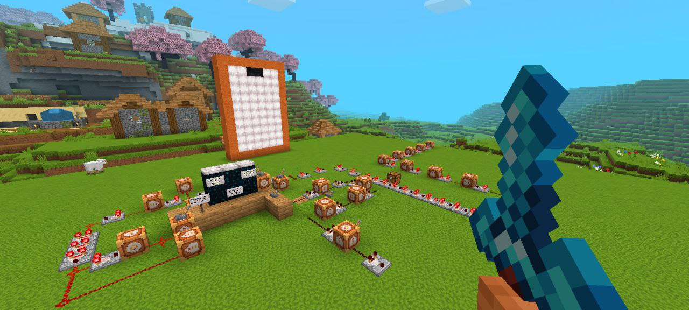
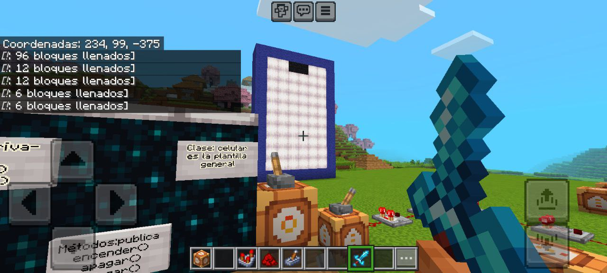
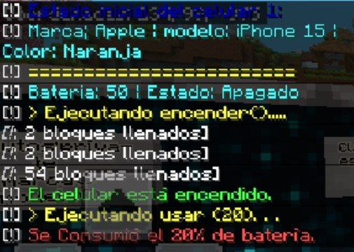

# 📱 Proyecto: Simulación de POO en Minecraft

Este proyecto demuestra los principios de la **Programación Orientada a Objetos** utilizando bloques de comandos y circuitos de Redstone. Simulamos la lógica de un **Teléfono Celular**.

---

## 1. Vista General del Sistema
Aquí se puede apreciar la estructura completa: la "pantalla" del celular al fondo y el sistema de circuitos que gestiona la lógica a la izquierda.

  

---

## 2. Conceptos Implementados
Definición de la **Clase Celular** dentro del juego.
* **Atributos (Private):** Marca, Modelo.
* **Métodos (Public):** encender(), apagar(), cargar().
* **Pilares:** Se aplican conceptos de *Abstracción* y *Encapsulamiento*.

  

---

## 3. Interfaz y Salida de Datos (Consola)
Al ejecutar los métodos mediante las palancas, el sistema procesa la lógica y devuelve el estado del objeto en el chat, simulando una consola de programación real.

| Interfaz Gráfica | Salida de Consola (Log) |
| :---: | :---: |
|  |  |

> **Log del Sistema:**
> Se puede observar en la consola:
> * Definición del objeto: *iPhone 15, Color Naranja*.
> * Ejecución del método `encender()`.
> * Consumo de batería al usar el dispositivo (Reducción del 20%).

---
*Proyecto creado por Mike Rodriguez - Evaluación 2026*
