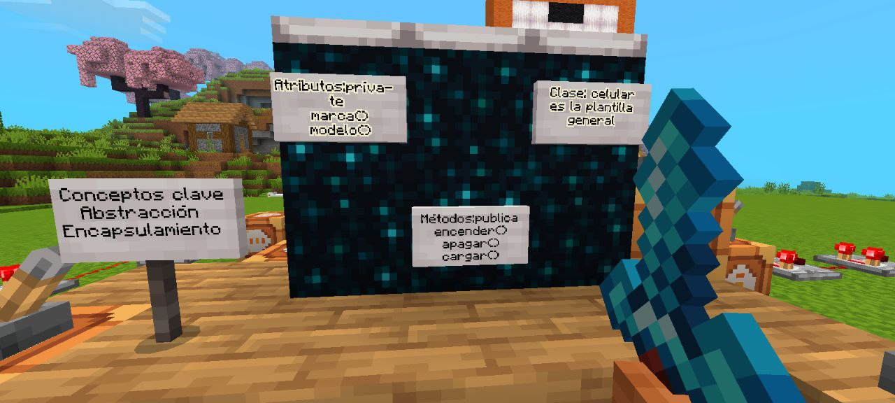

# 📱 Mi Celular en Minecraft (POO)

Proyecto para la evaluación 2026. Aplicación de lógica de programación y hardware virtual dentro de Minecraft.

---

## 📸 Evidencias del Proyecto
Aquí se puede ver la estructura completa del celular y la lógica de los comandos.

| Vista General | Conceptos Aplicados |
| :---: | :---: |
|  |  |

---

## 🎬 Demostración Funcional
En este clip se observa la ejecución de los métodos y la respuesta en el chat.

  

---
> Proyecto desarrollado por mikerodriguez1
> ---

## 📺 Video Demostrativo (HD)
Haz clic en la imagen de abajo para ver el video completo del funcionamiento en Google Drive:

> 💡 **Nota:** Si te pide permiso, asegúrate de que el archivo en Drive esté configurado como **"Cualquier persona con el enlace puede ver"**.
