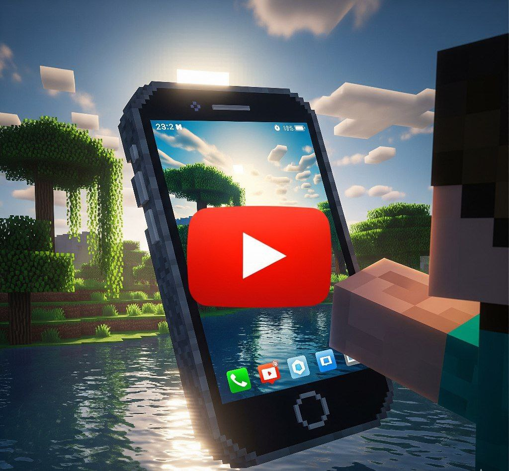

# 🥵 Mi Tarea de Minecraft POO

Proyecto para la evaluación 2026. Mostrar lo que hise en c+ pero en Minecraft 🤵🏻.

---

## 📸 Evidencias del Proyecto
Aqui se puede ver el teléfono que gendria siendo la clase y los comandos.

| Vista general | Conceptos Aplicados |
| :---: | :---: |
|  |  |

---

## 🎬 Demostración De q funciona 
En este clip se observa la ejecución de los métodos y la respuesta en el chat.

  

---
> No e dormido nada 😮‍💨
---

## 🎬 Video de demostración.
> **Haz clic en la imagen de abajo para reproducir el video 😲.**

  

  <kbd>▶️ REPRODUCIR VIDEO EN GOOGLE DRIVE</kbd>

---
